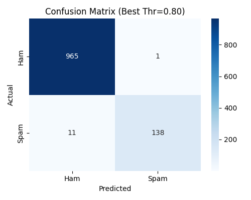
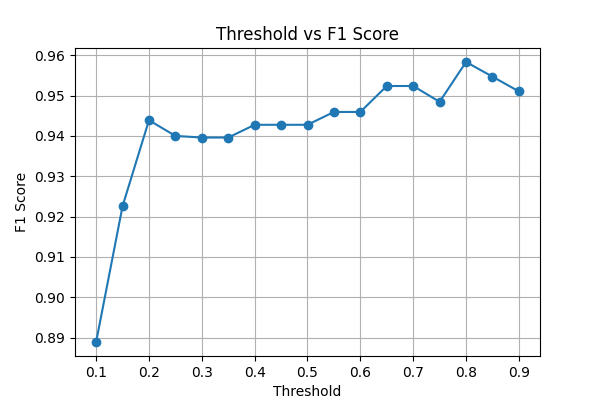

# Spam Classification with MLOps

This project classifies SMS messages as **spam** or **ham** using Logistic Regression and feature engineering.  
It demonstrates an **MLOps workflow** with:
- MLflow for experiment tracking,
- DVC for reproducible pipelines,
- Git for version control.

## Project Structure

├── data/                     # Dataset (not pushed, tracked with DVC)
├── outputs/                  # Model outputs (metrics, artifacts)
├── src/
│   └── train_log_mlflow.py   # Training + MLflow logging script
├── dvc.yaml                  # DVC pipeline definition
├── dvc.lock                  # Pipeline lock file
├── requirements.txt          # Python dependencies
└── README.md

## Results





## Setup
```bash
# Clone repo
git clone https://github.com/your-username/Spam-Classification-MLOps-Project.git
cd Spam-Classification-MLOps-Project

# Create environment
python -m venv .venv
.venv\Scripts\activate  # (Windows)

pip install -r requirements.txt

# Reproduce pipeline
dvc repro

# Launch MLflow UI
mlflow ui --backend-store-uri sqlite:///mlflow.db


