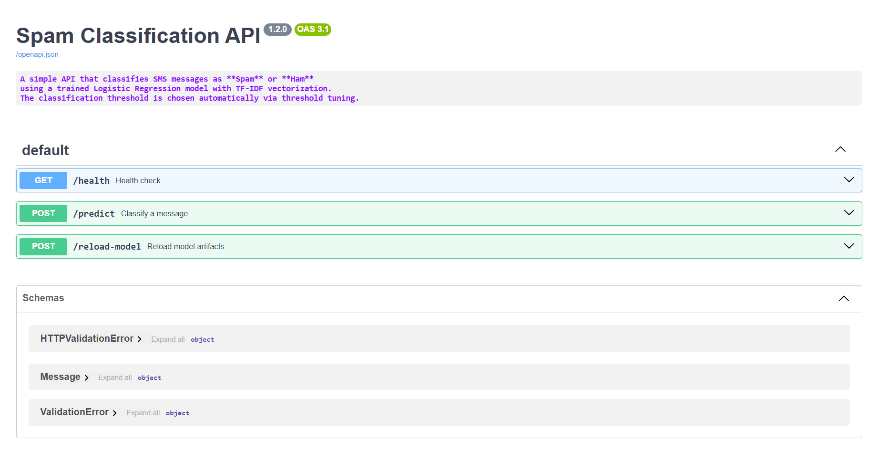

# 📧 Spam Classification with MLOps

## 1. Overview
This project implements an **SMS Spam Classification** pipeline using **Machine Learning + MLOps tools**.  
The goal is to classify incoming SMS messages as **Ham (not spam)** or **Spam**.  

### 🔹 Key Highlights
- **Dataset**: SMS Spam Collection (UCI ML Repository)
- **Model**: Logistic Regression with TF-IDF + threshold optimization
- **MLOps Tools**:
  - [x] **DVC** → Reproducible pipelines  
  - [x] **MLflow** → Experiment tracking & metrics logging  
  - [x] **Docker** → Containerized FastAPI deployment  
  - [x] **Git/GitHub** → Version control  

---

## 2. Dataset
- **Name**: SMS Spam Collection Dataset  
- **Source**: [UCI ML Repository](https://archive.ics.uci.edu/ml/datasets/sms+spam+collection)  
- **Size**: 5,574 SMS messages labeled as `ham` or `spam`  

---

## 3. Pipeline
The pipeline is built with **scikit-learn** and tracked via **DVC + MLflow**:

1. Data loading & preprocessing  
2. Feature engineering:
   - TF-IDF vectorization  
   - Custom text features (message length, digit count, punctuation count, uppercase ratio)  
3. Model training (Logistic Regression with class balancing & hyperparameter tuning)  
4. **Threshold sweep** (optimize decision threshold for best F1 score)  
5. MLflow logging (metrics + artifacts)  
6. DVC integration for reproducibility  

---

## 4. Results

### Confusion Matrix (Best Threshold)
The confusion matrix below shows the model’s predictions at the best threshold identified (optimized for F1 score):


---

### Threshold vs F1 Curve
This plot shows how the F1 score varies with the decision threshold. The highlighted best threshold maximizes performance:


---

### Swagger UI (FastAPI)
The trained model is deployed via **FastAPI + Docker**.  
Swagger UI provides an interactive interface for prediction and hot-reloading models:



---

### 5. Setup

### Clone and environment
```powershell
# Clone repo
git clone https://github.com/your-username/Spam-Classification-MLOps-Project.git
cd Spam-Classification-MLOps-Project

# Create environment
python -m venv .venv
.venv\Scripts\activate  # (Windows)

pip install -r requirements.txt

# Reproduce pipeline
dvc repro

# Launch MLflow UI
mlflow ui --backend-store-uri ./mlruns --host 127.0.0.1 --port 5000

# Dockerized deployment

```powershell
# Build Docker image
docker build -t spam-classifier:latest .

# Stop/remove old container
docker stop spam-api
docker rm spam-api

# Run new container (maps port 8000, mounts outputs/)
docker run -d --restart unless-stopped -p 8000:8000 `
  -v C:\path\to\Spam-Classification-MLOps-Project\outputs:/app/outputs `
  --name spam-api spam-classifier:latest


